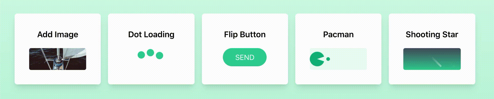

# Frontend Kata

My frontend kata practice eg. animation, website clone using React and Tailwindcss.

Visit site here: [https://frontend-kata.netlify.app](https://frontend-kata.netlify.app)



## Getting Started

```
yarn start
```
